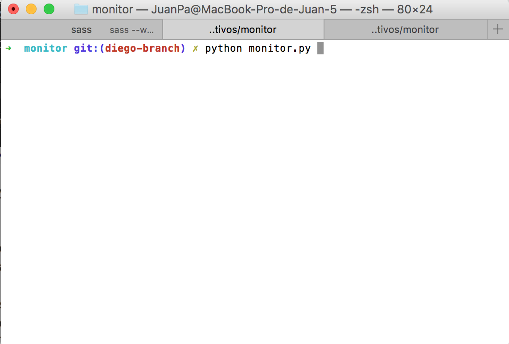

#Projecto de Sistemas Operativos - Gunnar Wolf

## Synopsis
El monitor de sistema tiene como objetivo brindarle al usuario algunos recursos basicos para poder analizar cómo su computadora esta utilizando los recursos para los procesos que lleva a cabo. Es un programa desarrollado en Python.

## Ejemplo de Código
Usemos el monitor para conseguir los datos de memoria de la computadora. Lo primero que tenemos que hacer es correr el programa


Una vez que hayamos iniciado el programa. Nos desplegará la lista de funciones:


Indicamos cual queremos usar:


Nos da los resultados.

Despues podemos salir del programa usando el comando `exit`


## Motivación

La motivación del projecto es aplicar de manera práctica los conocimiento adquiridos en los temas de manejo de hilos, concurrencia y procesos. 

## Instalación
La instalacion del projecto es sencilla, solo es necesario conocer algunas comandos básicos de git y python para correr el programa. 
```
cd ubicacion-folder
mkdir <nombre del folder>
git clone <git@github.com:juanpflores94/monitor.git> o <https://github.com/juanpflores94/monitor.git>
cd monitor
python monitor.py
```
## API 
El programa tiene una serie de comandos que se pueden ingresar al inicarlo para poder mostrar distinta informacion:
```
all: Enseña todos los datos del sistema.
memory: Enseña los datos de la memoria
process: Ensela los procesos que se estan corriendo en el CPU
disk: Enseña el uso del disco duro
protree: Despliega lo procesos que estan corriendo en ese momento en formato de arbol.
logins: Imprime los logins del sistema.
cpuinfo: Imprime la informacion de cada cpu existente en el sistema.
interrupts: Imprime las interrupciones a los cpu's.
clear: Limpia la pantalla.
exit: Salida del programa.
```
## Contribuidores
- Diego Alberto Barriga <umoqnier[at]gmail.com>
- Juan Pablo Flores <jp[at]temazcal.io>


## Licencia 

The MIT License (MIT)

Copyright (c) 2016 Juan Pablo Flores & Diego Barriga

Permission is hereby granted, free of charge, to any person obtaining a copy of this software and associated documentation files (the "Software"), to deal in the Software without restriction, including without limitation the rights to use, copy, modify, merge, publish, distribute, sublicense, and/or sell copies of the Software, and to permit persons to whom the Software is furnished to do so, subject to the following conditions:

The above copyright notice and this permission notice shall be included in all copies or substantial portions of the Software.

THE SOFTWARE IS PROVIDED "AS IS", WITHOUT WARRANTY OF ANY KIND, EXPRESS OR IMPLIED, INCLUDING BUT NOT LIMITED TO THE WARRANTIES OF MERCHANTABILITY, FITNESS FOR A PARTICULAR PURPOSE AND NONINFRINGEMENT. IN NO EVENT SHALL THE AUTHORS OR COPYRIGHT HOLDERS BE LIABLE FOR ANY CLAIM, DAMAGES OR OTHER LIABILITY, WHETHER IN AN ACTION OF CONTRACT, TORT OR OTHERWISE, ARISING FROM, OUT OF OR IN CONNECTION WITH THE SOFTWARE OR THE USE OR OTHER DEALINGS IN THE SOFTWARE.